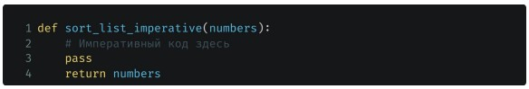
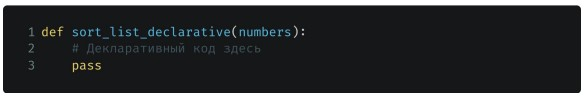
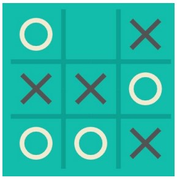
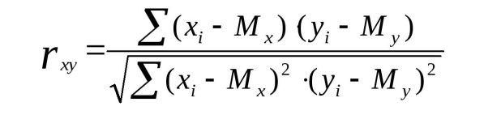

# Парадигмы программирования и языки парадигм

## HomeWork 1

● Задача №1
Дан список целых чисел numbers. Необходимо написать в императивном стиле процедуру для
сортировки числа в списке в порядке убывания. Можно использовать любой алгоритм сортировки.

● Задача №2
Написать точно такую же процедуру, но в декларативном стиле

## HomeWork 2

Таблица умножения

● Условие
На вход подается число n.

● Задача
Написать скрипт в любой парадигме, который выводит на экран таблицу умножения всех чисел от 1 до n.
Обоснуйте выбор парадигм.

● Пример вывода:
1 _ 1 = 1
1 _ 2 = 2
1 _ 3 = 3
1 _ 4 = 4
1 _ 5 = 5
1 _ 6 = 6
..
1 \* 9 = 9

## HomeWork 3

Крестики-нолики

● Контекст
Вероятнее всего, вы с детства знакомы с этой игрой. Пришло
время реализовать её. Два игрока по очереди ставят крестики
и нолики на игровое поле. Игра завершается когда кто-то
победил, либо наступила ничья, либо игроки отказались
играть.

● Задача
Написать игру в “Крестики-нолики”. Можете использовать
любые парадигмы, которые посчитаете наиболее
подходящими. Можете реализовать доску как угодно - как
одномерный массив или двумерный массив (массив массивов).
Можете использовать как правила, так и хардкод, на своё
усмотрение. Главное, чтобы в игру можно было поиграть через
терминал с вашего компьютера.

## HomeWork 4

● Контекст
Корреляция - статистическая мера, используемая для оценки
связи между двумя случайными величинами.
● Ваша задача
Написать скрипт для расчета корреляции Пирсона между
двумя случайными величинами (двумя массивами). Можете
использовать любую парадигму, но рекомендую использовать
функциональную, т.к. в этом примере она значительно
упростит вам жизнь.
● Формула корреляции Пирсона:

